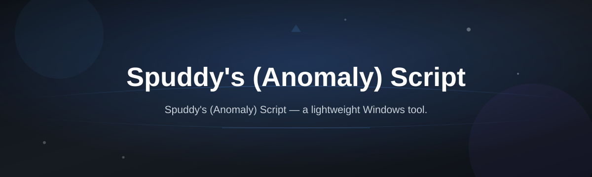
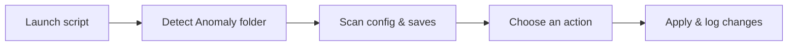

# spuddy-anomaly-script

*A quality-of-life companion for S.T.A.L.K.E.R. Anomaly players who want a smoother, less fiddly session without touching game files by hand.*

| Requirement | Details |
|---|---|
| OS | Windows 10 or 11 (64-bit) |
| Game | S.T.A.L.K.E.R. Anomaly (any recent build) |
| Install | Standalone — no toolchain, no dependencies to set up |
| Disk space | Under 50 MB |

## What this is

Spuddy's (Anomaly) Script is a small standalone Windows utility built specifically for people running S.T.A.L.K.E.R. Anomaly. It exists because Anomaly's settings, save management, and repetitive setup steps can get tedious across long play sessions — this script wraps the fiddly parts into a single lightweight app so you spend more time in the Zone and less time digging through config files.

It doesn't modify or replace core game files, and it isn't tied to any particular modlist. You run it alongside your existing Anomaly install, use the panel to handle the setup or maintenance tasks you'd otherwise do manually, and close it when you're done. Everything it does is meant to be transparent and reversible, which is why it ships as a plain .exe with no installer footprint left behind.

  

The button above opens the project's landing page, where you can grab the current build.

## Who it is for

- **Anomaly players** who want a cleaner way to manage sessions than editing INI files by hand
- **Modlist maintainers** looking for a repeatable setup helper they can point testers to
- **Returning players** coming back after a break who don't remember every config option
- **Stream and content creators** who need quick, predictable setup between recordings
- **Anyone new to Anomaly** who wants sane defaults without reading the whole wiki first

## What you can do

| Capability | What it means in practice |
|---|---|
| **Streamline first-time setup** | Get sensible starting options applied without manually editing files |
| **Manage save profiles** | Keep multiple playthroughs organized and switch between them cleanly |
| **Adjust common settings** | Change frequently-tweaked options through a simple panel |
| **Check your install state** | See at a glance whether key files and folders look correct |
| **Reset to a known-good state** | Roll back changes made through the script if something feels off |
| **Run portably** | Use it from a USB drive or any folder — nothing is written outside your Anomaly directory |
| **Keep a light footprint** | No background services, no scheduled tasks, no silent updates |
| **Work offline** | Everything runs locally once downloaded — no account or internet connection required |

## Getting started

1. Open the landing page using the download button above.
2. Download the current release for Windows.
3. Save the .exe somewhere convenient, ideally near your Anomaly install folder.
4. Run it — Windows may show a SmartScreen prompt for unsigned apps; choose "More info" then "Run anyway" if you trust the source.
5. Follow the on-screen panel to pick the setup or maintenance task you want.

## Requirements

- Windows 10 or 11 (64-bit)
- A working install of S.T.A.L.K.E.R. Anomaly
- No .NET runtime, Python, or build tools to install — it's a standalone executable
- Administrator rights are not required for normal use

## How it works

The script is intentionally simple under the hood:

1. It launches and reads your Anomaly install path (auto-detected or entered manually).
2. It scans key folders and config files to understand your current setup.
3. It presents available actions in a plain panel — setup, save management, settings.
4. Any change you confirm is applied directly to the relevant files.
5. A log of what changed is kept so you can review or undo it later.

## FAQ

**Is Spuddy's (Anomaly) Script an official part of S.T.A.L.K.E.R. Anomaly?**
No. It's an independent companion tool made for Anomaly players and isn't affiliated with the Anomaly development team.

**Does it edit my base game files permanently?**
It only edits the config and save-related files you explicitly choose to change through the panel, and it logs those changes so you can reverse them.

**Will it conflict with my modlist?**
It's designed to stay out of mod folders entirely and only touch general settings and save profiles, so conflicts are rare — but always back up a modlist you've spent time building.

**Do I need to reinstall Anomaly to use this?**
No. Point the script at your existing install and it works with what's already there.

**Why does Windows SmartScreen flag the download?**
The build isn't code-signed, which is normal for small independent Windows tools. Verify you downloaded it from the official landing page before running it.

## Troubleshooting

- **The script can't find my Anomaly folder** — Use the manual path option in the panel and point it directly at your Anomaly install directory.
- **SmartScreen or antivirus blocks the .exe** — This is common for unsigned indie tools. Confirm the download came from the official landing page, then allow it through your antivirus if you're comfortable doing so.
- **A setting didn't apply in-game** — Some options only take effect after a full game restart, not just a reload.
- **I want to undo a change** — Check the script's change log and use the reset option to restore the previous state.

## License

Released under the [MIT License](LICENSE). Spuddy's (Anomaly) Script is provided as-is, with no warranty; back up your saves and configs before making changes to your Anomaly install.

  

